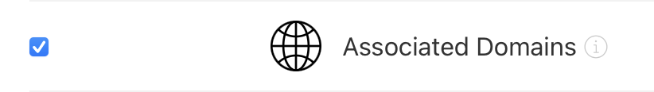
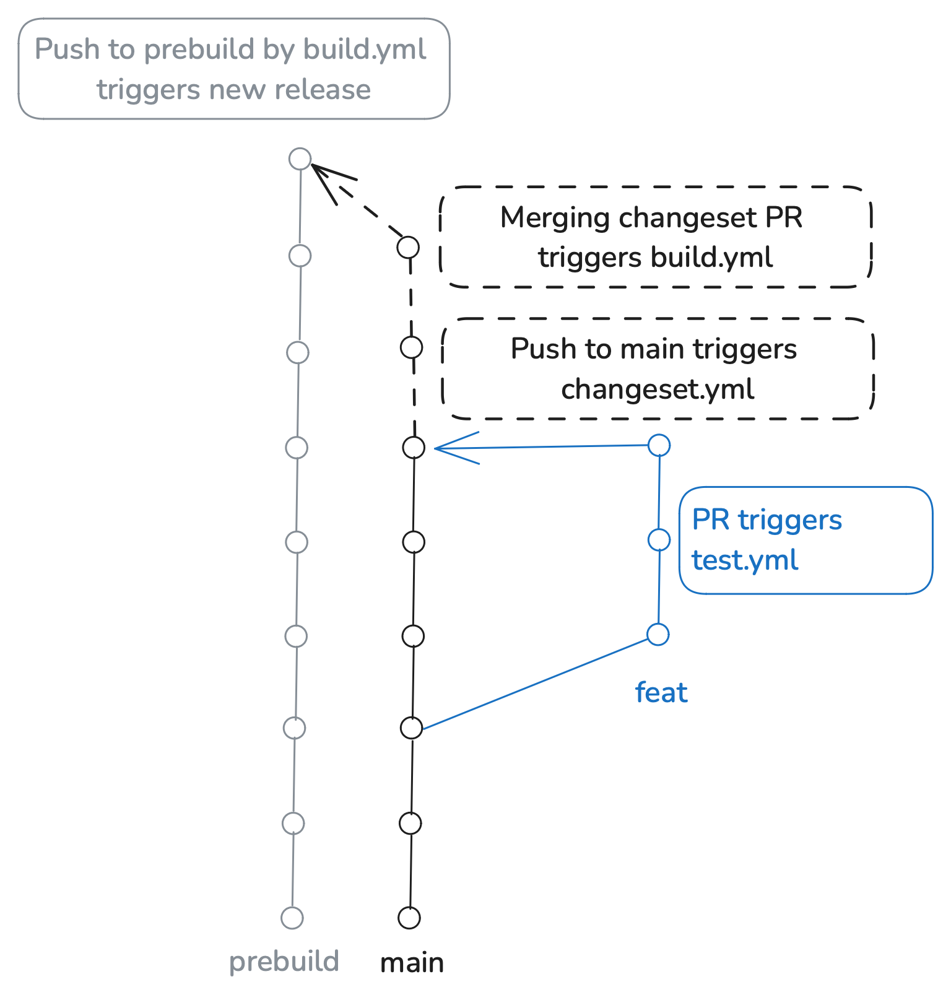

# electron-passkey

Native module for electron applications to use passkey funcitonality in macOS apps.

### Usage

1) Intercept calls in the renderer process or preload
```js
import { ipcRenderer } from 'electron';

navigator.credentials.create = function (options) {
  return ipcRenderer.invoke('webauthn-create', options);
};

navigator.credentials.get = function (options) {
  return ipcRenderer.invoke('webauthn-get', options);
};
```

2) Forward calls in main process

```js
import Passkey from 'electron-passkey';

ipcMain.handle('webauthn-create', (event, options) => {
  return Passkey.getInstance().handlePasskeyCreate(options);
});

ipcMain.handle('webauthn-get', (event, options) => {
  return Passkey.getInstance().handlePasskeyGet(options);
});
```

### Entitlements Setup

> **_NOTE:_** Ensure your AASA is passing validation **BEFORE** you check it against Apple's CDN **AND BEFORE** you run your application with the entitlements or Apple may temporarily cache an invalid AASA and you will be stuck until they recheck

1) In developer.apple.com create an app identifier
2) Enable Associated Domains for your identifier

3) You may need to create a provisioning profile for macOS development on your device and/or for distribution
4) Create a webserver to serve an AASA file [as specificed in the docs](https://developer.apple.com/documentation/xcode/supporting-associated-domains#Add-the-associated-domain-file-to-your-website)
5) Test it with the [yURL validator](https://yurl.chayev.com) and/or [branch.io validator](https://branch.io/resources/aasa-validator/)
6) Add the following to your entitlements plist
```
<key>com.apple.application-identifier</key>
<string>TEAMID.APP-ID</string>
<key>com.apple.developer.associated-domains</key>
<array>
  <string>applinks:DOMAIN</string>
  <string>webcredentials:DOMAIN</string>
</array>
```
7) Check to see if your AASA is being cached by the Apple CDN at `https://app-site-association.cdn-apple.com/a/v1/DOMAIN`
8) Build your electron application and sign it

### Deployments

Here is how this repo handles deployments:

